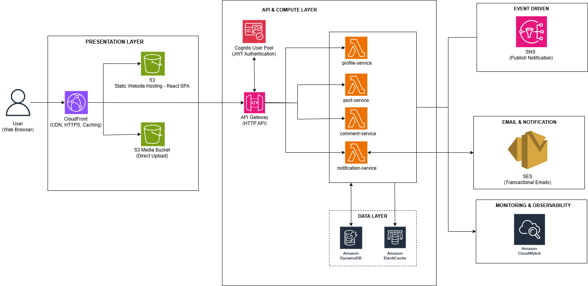

# AWS Serverless Blog Platform

Nền tảng blog hiện đại được xây dựng hoàn toàn trên kiến trúc Serverless của AWS, sử dụng Java 21 và Spring Boot 3.4. Dự án minh họa best practices cho việc xây dựng microservices trên AWS.

## 🏗️ Architecture



## ✨ Features

- **Authentication** - Đăng nhập/Đăng ký với AWS Cognito, JWT tokens
- **Blog Posts** - CRUD bài viết với Markdown support
- **Comments** - Hệ thống bình luận real-time
- **User Profiles** - Quản lý profile, upload avatar
- **Email Notifications** - Thông báo qua email (SNS + SES/Brevo)
- **Media Storage** - Upload ảnh lên S3 với pre-signed URLs

## 🛠️ Tech Stack

### Backend
| Technology | Purpose |
|------------|---------|
| Java 21 | Runtime |
| Spring Boot 3.4 | Application Framework |
| AWS Lambda | Serverless Compute |
| AWS SAM | Infrastructure as Code |
| DynamoDB | NoSQL Database (Single Table Design) |
| Amazon SNS | Event-driven Messaging |
| Amazon Cognito | Authentication |
| Amazon S3 | Media Storage |

### Frontend
| Technology | Purpose |
|------------|---------|
| React 19 | UI Framework |
| TypeScript | Type Safety |
| Tailwind CSS 4 | Styling |
| Vite | Build Tool |

## 📁 Project Structure

```
├── common/                  # Shared module (entities, events, services)
├── profile-service/         # User management Lambda
├── post-service/            # Blog posts Lambda
├── comment-service/         # Comments Lambda
├── notification-service/    # Email notifications Lambda (SNS triggered)
├── web-app/ServerlessBlog/  # React frontend
└── infrastructure/          # CloudFormation templates
```

## 🗄️ DynamoDB Single Table Design

| Entity | PK | SK |
|--------|----|----|
| User | `USER#<username>` | `PROFILE` |
| Post | `POST#<postId>` | `METADATA` |
| Comment | `POST#<postId>` | `COMMENT#<commentId>` |

## 🔔 Event-Driven Architecture

```
Services (post/comment/profile)
         │
         ▼
       SNS Topic
         │
         ▼
  notification-service (Lambda)
         │
         ▼
    SES / Brevo (Email)
```

**Event Types:** `NEW_USER`, `NEW_POST`, `NEW_COMMENT`

## 📊 AWS Services Used

| Service | Purpose |
|---------|---------|
| API Gateway | HTTP API endpoints |
| Lambda | Serverless compute |
| DynamoDB | Primary database |
| Cognito | User authentication |
| SNS | Event notifications |
| S3 | Static hosting & media storage |
| CloudWatch | Monitoring & logging |
| Secrets Manager | API keys storage |

## 👨‍💻 Author

**Le Khanh Duc**
- GitHub: [@lekhanhduc](https://github.com/lekhanhduc)

---

⭐ Star this repo if you find it helpful!
