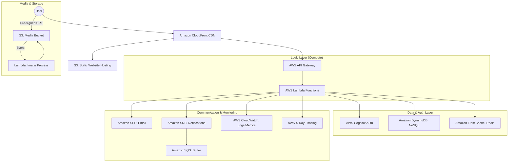

# Software Requirements Specification (SRS) - Serverless Blog Platform
**Project**: JavaBuilder.online Blog Ecosystem  
**Architecture**: AWS Serverless (Cloud-Native)  
**Version**: 1.2 (Standard Detailed Edition)  
**Date**: January 12, 2026

---

## 1. Introduction
### 1.1 Purpose
This document provides a detailed specification for the Serverless Blog Platform for JavaBuilder.online. It serves as a blueprint for developers to build a scalable, secure, and cost-effective blogging system using AWS managed services, while demonstrating professional proficiency for the AWS Certified Developer Associate track.

### 1.2 Target Audience
- Developers implementing the serverless logic (Lambda).
- Cloud Engineers managing the AWS infrastructure (CDK/CloudFormation).
- Frontend Developers building the React SPA.

---

## 2. System Architecture & AWS Services
### 2.1 High-Level Architecture Diagram

### 2.2 Detailed Service Role
| Service | Role & Configuration |
|:---|:---|
| **AWS Cognito** | Manages User Pools (identities) and Identity Pools (access). Uses JWT for session management. |
| **AWS Lambda** | Executes business logic. Triggered by API Gateway, S3 events, or EventBridge (for scheduling). |
| **Amazon DynamoDB** | Stores articles, comments, and user metadata. Uses GSI (Global Secondary Indexes) for efficient querying by Category, Tags, or Author. |
| **AWS API Gateway** | Provides RESTful endpoints. Integrated with Cognito Authorizer for secure access. |
| **Amazon S3** | 1) Hosts React SPA frontend. 2) Stores original and processed images. |
| **Amazon CloudFront** | Speeds up content delivery globally. Handles SSL/TLS and security headers. |
| **Amazon SES** | Sends transactional emails (verifications) and newsletters via verified identities. |
| **Amazon ElastiCache** | Redis-managed service to cache frequently read post content and view counts to reduce DynamoDB costs. |
| **AWS EventBridge** | Schedules post publishing (Cron jobs) and connects decoupled microservices. |

---

## 3. Operational Flows (Key Workflows)

### 3.1 Content Creation & Publishing Workflow
1. **Drafting**: Author creates a post via React UI → API Gateway → `post-create` Lambda → Saved to DynamoDB (Status: `DRAFT`).
2. **Media Upload**: React UI requests Pre-signed URL → Lambda returns URL → Browser uploads image directly to S3.
3. **Image Processing**: S3 triggers `image-process` Lambda → Resizes to WebP/Thumbnail → Updates DynamoDB metadata.
4. **Publishing**: Author updates status to `PUBLISHED` (or schedules via EventBridge) → `post-update` Lambda → Invalidates CloudFront cache → Triggers SNS notification to subscribers.

### 3.2 Secure Authentication Flow
1. **Signup**: User submits email/password → Cognito creates user in `UNCONFIRMED` state.
2. **Verification**: Cognito triggers SES to send code → User submits code via API → Cognito confirms user.
3. **Login**: User authenticates → Cognito returns ID, Access, and Refresh tokens (JWT).
4. **Authorized Request**: Frontend sends Access Token in `Authorization` header → API Gateway (Cognito Authorizer) validates → Lambda executes logic.

---

## 4. Functional Requirements

### 4.1 Blog Post Management
- **Markdown Editor**: Support for rich text, code snippets, and table of contents.
- **Categorization**: Multi-tagging and single category assignment.
- **SEO Optimization**: Automatic slug generation from title, meta tag management.
- **Advanced Search**: Implementation of DynamoDB filtering or integration with OpenSearch (future phase).

### 4.2 Engagement System
- **Comments**: Recursive/nested comments with status control (Pending/Approved/Spam).
- **Social Interaction**: "Clap" or "Like" functionality logged in DynamoDB.
- **Email Subscriptions**: Opt-in/out newsletter system managed via SNS topics.

---

## 5. Non-Functional Requirements (SLA & Compliance)
- **Scalability**: Cold start optimization for Lambda (Provisioned Concurrency where needed). DynamoDB On-Demand for traffic spikes.
- **Availability**: 99.99% for S3/CloudFront; Regional multi-AZ for Lambda/DynamoDB.
- **Security**:
  - **IAM**: Principle of Least Privilege.
  - **Network**: Lambda in VPC for ElastiCache; VPC Endpoints for S3/DynamoDB.
  - **Encryption**: KMS-managed keys for EBS/S3 volumes.
- **CI/CD**: Fully automated via AWS CodePipeline. Every commit to `main` deploys to Staging; Manual Approval for Production.

---

## 6. API Interface Specification (Draft)
- `POST /posts`: Create a new post.
- `GET /posts/{slug}`: Retrieve a single post (Cached via CloudFront/Redis).
- `PUT /posts/{id}/publish`: Change status to published.
- `POST /images/upload-url`: Get S3 Pre-signed URL.
- `GET /comments/post/{postId}`: Retrieve all comments for a post.

---

## 7. Data Schema (DynamoDB Primary Table)
- **PK**: `POST#<PostId>` | **SK**: `METADATA`
- **PK**: `USER#<UserId>` | **SK**: `PROFILE`
- **PK**: `POST#<PostId>` | **SK**: `COMMENT#<CommentId>`
- **GSI1-PK**: `CATEGORY#<CategoryName>` | **SK**: `CREATED_AT`
