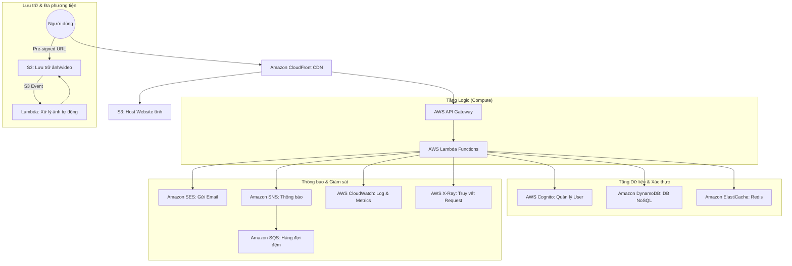

# Đặc Tả Yêu Cầu Phần Mềm (SRS) - Nền Tảng Blog Serverless
**Dự án**: Hệ sinh thái Blog JavaBuilder.online  
**Kiến trúc**: AWS Serverless (Cloud-Native)  
**Phiên bản**: 1.2 (Bản đặc tả chi tiết)  
**Ngày**: 12 tháng 01, 2026

---

## 1. Giới thiệu
### 1.1 Mục đích
Tài liệu này cung cấp các đặc tả chi tiết cho Nền tảng Blog Serverless của JavaBuilder.online. Đây là bản thiết kế chuẩn cho phép các nhà phát triển xây dựng một hệ thống blog có khả năng mở rộng cực cao, bảo mật và tối ưu chi phí sử dụng các dịch vụ quản lý của AWS. Đồng thời, dự án này được thiết kế để áp dụng các kiến thức chuyên sâu cho chứng chỉ AWS Certified Developer Associate.

### 1.2 Đối tượng hướng tới
- Nhà phát triển Backend (Lambda, API Gateway).
- Kỹ sư Cloud/DevOps (Quản lý hạ tầng qua CDK/AWS CLI).
- Nhà phát triển Frontend (React SPA).

---

## 2. Kiến trúc Hệ thống & Các Dịch vụ AWS
### 2.1 Sơ đồ Kiến trúc Cấp cao


### 2.2 Vai trò chi tiết của các dịch vụ
| Dịch vụ | Vai trò & Cấu hình then chốt |
|:---|:---|
| **AWS Cognito** | Quản lý User Pool (định danh người dùng) và Identity Pool. Sử dụng JWT (JSON Web Token) để quản lý phiên đăng nhập an toàn. |
| **AWS Lambda** | Thực thi code backend mà không cần quản lý server. Được kích hoạt bởi API Gateway, S3 event, hoặc EventBridge (để lập lịch). |
| **Amazon DynamoDB** | Lưu trữ bài viết, bình luận và thông tin người dùng. Sử dụng GSI (Global Secondary Indexes) để tìm kiếm nhanh theo Danh mục, Tag hoặc Tác giả. |
| **AWS API Gateway** | Cung cấp các điểm cuối RESTful. Tích hợp Cognito Authorizer để đảm bảo chỉ người dùng hợp lệ mới có thể đăng bài. |
| **Amazon S3** | 1) Host frontend React (SPA). 2) Lưu trữ hình ảnh gốc và hình ảnh đã qua xử lý (WebP, Thumbnail). |
| **Amazon CloudFront** | Tăng tốc độ phân phối nội dung toàn cầu, hỗ trợ SSL/TLS (HTTPS) và cấu hình các Security Headers. |
| **Amazon SES** | Gửi email kích hoạt tài khoản, thông báo bài viết mới và bản tin định kỳ. |
| **Amazon ElastiCache** | Sử dụng Redis để lưu trữ tạm thời các bài viết hot và số lượt xem, giúp giảm tải và chi phí truy vấn vào DynamoDB. |
| **AWS EventBridge** | Lập lịch xuất bản bài viết (Cron jobs) và liên kết các microservices theo cơ chế Event-driven. |

---

## 3. Luồng Hoạt động Hệ thống (Workflows)

### 3.1 Luồng Tạo và Xuất bản Nội dung
1. **Soạn thảo**: Tác giả viết bài trên giao diện React → API Gateway → `post-create` Lambda → Lưu vào DynamoDB (Trạng thái: `DRAFT`).
2. **Tải ảnh**: React UI yêu cầu Pre-signed URL từ Lambda → Client tải ảnh trực tiếp lên S3 của AWS để tiết kiệm tài nguyên backend.
3. **Xử lý ảnh**: S3 kích hoạt Lambda xử lý ảnh ngay lập tức → Cắt ảnh, tối ưu dung lượng (WebP) → Cập nhật metadata vào DynamoDB.
4. **Xuất bản**: Tác giả xác nhận xuất bản → Lambda cập nhật trạng thái `PUBLISHED` → Xóa cache cũ trên CloudFront → Gửi thông báo qua SNS đến người đăng ký.

### 3.2 Luồng Xác thực An toàn
1. **Đăng ký**: Người dùng nhập Email/Password → Cognito tạo user ở trạng thái `UNCONFIRMED`.
2. **Xác minh**: Cognito gọi SES gửi mã xác nhận về email → Người dùng nhập mã → Cognito kích hoạt tài khoản.
3. **Đăng nhập**: Cognito xác thực và trả về bộ 3 tokens: ID, Access, và Refresh Token.
4. **Truy cập API**: Frontend gửi Access Token trong header `Authorization` → API Gateway tự động kiểm tra token qua Authorizer trước khi cho phép gọi Lambda.

---

## 4. Yêu cầu Chức năng chi tiết

### 4.1 Quản lý bài viết chuyên sâu
- **Markdown Editor**: Hỗ trợ định dạng văn bản, chèn code block (highlighting) và tự động tạo mục lục.
- **Phân loại**: Hệ thống đa thẻ (Tags) và phân loại theo chủ đề (Categories).
- **Tối ưu SEO**: Tự động tạo Slug từ tiêu đề, quản lý các thẻ meta (Title, Description) cho từng bài viết.
- **Tìm kiếm**: Tìm kiếm theo từ khóa trong tiêu đề và tóm tắt bài viết.

### 4.2 Hệ thống Tương tác
- **Bình luận**: Hỗ trợ bình luận phân cấp (nested comments) với cơ chế kiểm duyệt của Admin (Duyệt/Ẩn bình luận).
- **Tương tác**: Chức năng "Thích" hoặc "Vỗ tay" được ghi lại không đồng bộ để tăng hiệu năng.
- **Đăng ký nhận tin**: Hệ thống Opt-in/out nhận bản tin qua email thông qua SNS Topics.

---

## 5. Yêu cầu Phi chức năng (SLA & Bảo mật)
- **Khả năng mở rộng**: Tối ưu hóa Lambda Cold Start bằng Provisioned Concurrency. DynamoDB được cấu hình On-Demand để xử lý các đợt lưu lượng truy cập đột biến.
- **Tính khả dụng**: S3/CloudFront đạt 99.99%; Lambda/DynamoDB triển khai Multi-AZ trong khu vực Singapore.
- **Bảo mật**:
  - **IAM**: Áp dụng nguyên tắc quyền tối thiểu (Least Privilege).
  - **Mạng**: Lambda chạy trong VPC để kết nối Redis; Sử dụng VPC Endpoints cho S3/DynamoDB để dữ liệu không đi qua internet công cộng.
- **CI/CD**: Quy trình tự động 100% qua CodePipeline. Mọi commit vào nhánh `main` sẽ được deploy lên môi trường Staging. Môi trường Production cần sự phê duyệt thủ công.

---

## 6. Kiến trúc Tầng Compute (Mô hình 5 Services thực tế)

Thay vì chia nhỏ từng hàm, chúng ta gom nhóm theo tài nguyên để tối ưu Cold Start (đặc biệt quan trọng với Java SnapStart) và dễ quản lý.

| Lambda Service | Runtime | Trách nhiệm | Trigger |
|:---|:---|:---|:---|
| **Identity-Svc** | Java 17 | Đăng ký, Đăng nhập, Quản lý Token (Cognito) | API Gateway |
| **Blog-Svc** | Java 17 | Toàn bộ CRUD Bài viết (Xem, Tạo, Sửa, Xóa) | API Gateway |
| **Interaction-Svc**| Java 17 | Bình luận, Lượt thích, Tương tác người dùng | API Gateway |
| **Media-Worker** | Python 3.11| Xử lý ảnh (Resize, WebP, Thumbnail) | S3 Event |
| **Notify-Worker** | Java 17 | Gửi Email thông báo qua SES | SQS |

---

## 7. Định nghĩa Giao diện API (Bản thảo)
- `POST /posts`: Tạo bài viết mới.
- `GET /posts/{slug}`: Lấy chi tiết bài viết (Đã cache qua CloudFront/Redis).
- `PUT /posts/{id}/publish`: Chuyển trạng thái sang xuất bản.
- `POST /images/upload-url`: Lấy Pre-signed URL để upload ảnh.
- `GET /comments/post/{postId}`: Lấy danh sách bình luận theo bài viết.

---

## 8. Cấu trúc Dữ liệu DynamoDB (Single Table Design)
- **PK**: `POST#<PostId>` | **SK**: `METADATA`
- **PK**: `USER#<UserId>` | **SK**: `PROFILE`
- **PK**: `POST#<PostId>` | **SK**: `COMMENT#<CommentId>`
- **GSI1-PK**: `CATEGORY#<CategoryName>` | **SK**: `CREATED_AT`

---

## 9. Hướng dẫn Triển khai & Cấu trúc Code

### 9.1 Cấu trúc Dự án (Multi-module Maven/Gradle)
Để các Service dùng chung được Entity/DTO mà vẫn đảm bảo tính độc lập, ta tổ chức theo mô hình Multi-module:

```text
/aws-serverless-blog
  ├── common-lib/        (Chứa Entity @DynamoDbBean, DTO, Shared Utils)
  ├── identity-service/  (Module chứa logic Auth)
  ├── blog-service/      (Module chứa logic CRUD bài viết)
  ├── interaction-svc/   (Module chứa logic Bình luận)
  ├── media-worker/      (Script Python xử lý ảnh)
  ├── notification-svc/  (Module xử lý gửi Email)
  └── infra-cdk/         (Sử dụng AWS CDK để định nghĩa hạ tầng)
```

### 9.2 Cách xây dựng Entity (Java SDK v2)
- **Shared Entity**: Định nghĩa trong `common-lib`. Sử dụng Annotation `@DynamoDbBean` của AWS SDK v2. Các class này ánh xạ trực tiếp xuống Single Table của DynamoDB.
- **DTO (Data Transfer Object)**: Tạo các lớp DTO riêng cho mỗi API để đóng gói dữ liệu phản hồi, tránh lộ các trường kỹ thuật của Database.

### 9.3 Quy trình Triển khai (CI/CD)
1. **Infrastructure as Code (IaC)**: Dùng **AWS CDK** vì nó hỗ trợ Java rất tốt, cho phép bạn viết code định nghĩa hạ tầng ngay bằng ngôn ngữ bạn quen thuộc.
2. **Deploy**: 
   - Compile code Java thành file `.jar`.
   - Chạy lệnh `cdk deploy` để AWS tự động thiết lập API Gateway kết nối với Lambda, tạo bảng DynamoDB và phân quyền IAM tự động.
3. **Tối ưu**: Kích hoạt **SnapStart** trên các Lambda viết bằng Java. Đây là bước sống còn để app Java của bạn chạy nhanh ngang ngửa Node.js trên môi trường Serverless.
